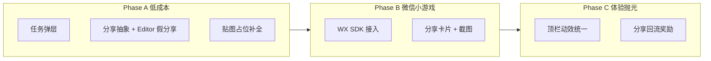

# v1.5 打磨计划（分享 SDK · 任务页 UI · 体验抛光）

> **文档版本**：v1.5 Polish Plan  
> **基准**：Step 1～12 MVP 已完成（`v1.5_Upgrade_Cursor.md`）  
> **更新**：2026-06-18  
> **状态**：规划文档，待产品拍板后按 Phase 执行

---

## 一、文档目的

在 v1.5 核心玩法（逐房揭示、中途卖、图鉴、连击视觉、每日目标、商店 Lv.3、主界面壳层）已落地的前提下，记录 **分享 SDK、任务入口 UI、贴图与体验抛光** 的方案、实现预期与验收标准。

**不包含**：复活 v1.3 多随机每日任务、成就系统、玩家等级等已砍系统。

---

## 二、当前状态（Step 12 之后）

| 模块 | 现状 | 缺口 |
|------|------|------|
| 顶栏 `MainShellUI` | `🛒 Lv.n` + 金币 + `🎯 n/500` + `+50` 领取 | 商店等级仅文字，无独立 Lv 图标 |
| 底栏导航 | 市场 / 背包 / 商店 / 图鉴 / 任务 | 「任务」仅 `Debug.Log` + 徽章复用每日目标进度 |
| 每日目标 `DailyTarget` | 完整：卖出累计 500 → 领 50，跨天重置 | 无独立说明/领奖面板 |
| 分享 | 爆肉或连击≥3 显示「炫耀一下」 | 点击仅 `Debug.Log`，无 SDK |
| 平台层 | 无 `Platform/`、无微信封装 | 分享需新建抽象层 |

### 与设计文档对齐

v1.5 分析文档（`analysis/v1.5_Gambling_Stone_Analysis.md`）明确：

- **每日任务系统已删除**，改为 **单一每日目标**「今日赚 500 金」。
- 底栏「任务」**不应**做成 2 个随机任务面板，而是 **每日目标说明 + 领奖** 的轻量入口。

---

## 三、打磨总览（建议 3 个 Phase）



| Phase | 范围 | 预估改动量 | 适合时机 |
|-------|------|------------|----------|
| **A** | 任务弹层 + 分享接口 + 占位图 | ~300～450 行，2～3 个新脚本 | 不依赖平台账号，**可立即开工** |
| **B** | 微信小游戏真实分享 | ~200～400 行 + SDK 配置 | 有微信小游戏工程 / 资质后 |
| **C** | 回流、动效、数据埋点 | 视产品需求 | 上线前抛光 |

### 推荐落地顺序

1. **Phase A-1**：任务弹层（澄清「任务」= 每日目标）
2. **Phase A-2**：`ShareService` + Editor 假分享 + 按钮反馈
3. **贴图占位**：CO-01、CB-01～03（或编辑器一键占位，见 `v1.5_缺失贴图与空字段清单.md`）
4. **Phase B**：确认目标平台为微信小游戏后接 WX Provider
5. **Phase C**：分享奖励（若需要增长）

---

## 四、模块 1：任务页 UI（底栏「任务」）

### 4.1 产品定位

| 不做 | 做 |
|------|-----|
| 2 个随机每日任务 | 1 个固定目标「今日卖出累计 500 金」 |
| 全屏复杂任务面板（DQ-01 底图） | 轻量弹层：规则 + 进度 + 领奖 |
| 与顶栏重复的独立任务数值 | 与 `DailyTarget` / 顶栏 **同一数据源** |

**顶栏 vs 任务入口：**

- **顶栏**：快捷看进度 + 一键领奖（已有）
- **任务弹层**：规则说明、进度条、领奖状态、次日重置提示（新玩家友好）

### 4.2 UI 方案（推荐：弹层，非全屏页）

```
┌─────────────────────────────┐
│  [×]  今日目标                 │
│  ─────────────────────────   │
│  今日卖出累计达到 500 金币      │
│  [========····] 320/500      │
│  奖励：50 金币                 │
│  [ 领取 +50 ]  （达标后可点）   │
│  明日 0 点重置                 │
└─────────────────────────────┘
```

### 4.3 技术方案

| 项 | 方案 |
|----|------|
| 脚本 | 新建 `DailyTargetPanel.cs`（或作为 `MainShellUI` 子逻辑） |
| 场景节点 | `MainShell/QuestPanel`（默认 `SetActive(false)`） |
| 数据 | 只读 `DailyTarget`；领奖调用 `ClaimReward()` |
| 导航 | 底栏 `Quest` → 打开弹层；关闭后仍停留当前 Hub 页 |
| 徽章 | 与顶栏一致：未完成显示 `n/500`，达标未领显示 `!`，已领隐藏 |
| 贴图 | **不需要 DQ-01**；半透明 Panel + 现有金币图标即可 |

### 4.4 涉及文件（预期）

| 操作 | 路径 |
|------|------|
| 新建 | `Assets/_Project/Scripts/View/DailyTargetPanel.cs` |
| 修改 | `Assets/_Project/Scripts/View/MainShellUI.cs`（打开/关闭弹层） |
| 修改 | `Assets/Editor/MvpSceneSetupEditor.cs`（`Wire T13` 或扩展 T12） |
| 场景 | `Assets/Scenes/Main.unity` — `MainShell/QuestPanel` |

### 4.5 验收标准

1. 点底栏「任务」→ 弹层出现，数字与顶栏一致。
2. 达标未领 → 弹层与顶栏均可领 +50；领后两处同步「今日已领」。
3. 开果 / 售卖页不显示底栏，任务入口不可达。
4. `PageTransition` 切换 Hub 页不受影响。

**预估工作量**：0.5～1 天。

---

## 五、模块 2：分享 SDK

### 5.1 触发条件（已实现，保持不变）

`DurianOpener` 在 **5 房全开结算** 后：

- `YieldGrade.Perfect`（爆肉），或
- `StreakCounter.CurrentStreak >= 3`

→ 显示 `ShareButtonGroup` / 「炫耀一下」。

相关代码：`Assets/_Project/Scripts/Component/DurianOpener.cs`。

### 5.2 架构方案（推荐）

```
DurianOpener.OnShareClicked()
    → ShareService.TryShare(ShareContext)
        → IShareProvider（平台实现）
            → EditorShareProvider      （Editor / Standalone：Log + 假成功）
            → WeChatMiniGameShareProvider（微信 WASM 真 SDK）
```

| 文件（预期） | 职责 |
|--------------|------|
| `ShareContext` | 品种、评级文案、估价、连击数、截图纹理（可选） |
| `IShareProvider` | `bool TryShare(ShareContext ctx)` |
| `ShareService` | VContainer Singleton，按编译宏 / 运行时选择 Provider |
| `DurianOpener` | 只调 `ShareService`，移除直接 `Debug.Log` |

**原则**：开果组件不引用微信 API；换平台只换 Provider。

### 5.3 Phase A：无 SDK 的可交付预期

| 能力 | 预期表现 |
|------|----------|
| Editor / PC | 点击「炫耀一下」→ Console 打印结构化分享文案 |
| 分享文案示例 | `「我在榴莲大亨开出了爆肉金枕，估价 1280 金！」` |
| UI 反馈 | 按钮短暂变为「已分享」或一行 Toast（DOTween ~0.3s） |
| 可选事件 | `EventBus.Publish(ShareSucceededEvent)` 供 UI / 奖励监听 |
| 失败 | Provider 返回 false → 可重试，不阻断流程 |

**预估工作量**：0.5 天。

### 5.4 Phase B：微信小游戏真实分享

**前提**：Unity 导出微信小游戏，已集成 `WX-WASM-SDK` 或官方插件。

| 能力 | 实现预期 |
|------|----------|
| 分享类型 | 先 **转发给朋友**（`shareAppMessage`） |
| 分享参数 | `title` + `imageUrl` |
| 图片 v1.5 最小方案 | 固定 `share_default.png`（符合微信尺寸要求） |
| 图片进阶方案 | 运行时拼：评级图标 + 榴莲图 + 估价（`RenderTexture` 截图） |
| 回调 | 成功 / 失败 UI 提示；是否给金币由产品定（见 Phase C） |

**风险点**：

- 微信分享图域名与审核
- WASM 下截图与文件路径
- 与广告按钮连点防抖

**预估工作量**：2～4 天（含真机 / 开发者工具调试）。

### 5.5 Phase C（可选）：分享回流奖励

| 方案 | 说明 |
|------|------|
| 轻量 | 分享成功 → +10 金，每日限 1 次（`PlayerPrefs`） |
| 标准 | `ShareRewardTracker`：分享次数、回流 UV（需微信 `onShow` + `query`） |
| 不做 | 纯炫耀、无奖励（最符合当前 MVP） |

**建议**：若要做增长，优先「轻量 +10 金、每日 1 次」。

### 5.6 涉及文件（预期）

| 操作 | 路径 |
|------|------|
| 新建 | `Assets/_Project/Scripts/System/ShareContext.cs`（或放 Model） |
| 新建 | `Assets/_Project/Scripts/Platform/IShareProvider.cs` |
| 新建 | `Assets/_Project/Scripts/Platform/EditorShareProvider.cs` |
| 新建 | `Assets/_Project/Scripts/Platform/WeChatMiniGameShareProvider.cs`（Phase B） |
| 新建 | `Assets/_Project/Scripts/System/ShareService.cs` |
| 修改 | `DurianOpener.cs`、`GameLifetimeScope.cs` |
| 可选 | `GameEvents.cs` — `ShareSucceededEvent` |

---

## 六、模块 3：其它可一并打磨项

| 项 | 现状 | 打磨预期 | 优先级 |
|----|------|----------|--------|
| CB-01～03 图鉴贴图 | `DurianSpriteConfig` 空字段 | 补图或 `TextureValidator` 占位绑定 | 中 |
| CO-01 连击火焰 | 可能仍空 | 绑定 `comboFlameFx`，连击≥2 火焰+数字 | 中 |
| 商店 Lv 图标 | 仅 `🛒 Lv.n` 文字 | 小徽章图或复用 `upgradeEffect` | 低 |
| 顶栏 Lv 可点击 | 不可点 | 点击跳转 `ShowShop()` | 低 |
| 分享截图含 UI | 无 | Phase B 进阶 | 低 |
| 成就系统 | 已砍 | **不建议复活** | — |

详见：`v1.5_缺失贴图与空字段清单.md`。

---

## 七、各 Phase 验收清单（Play 模式）

### Phase A

- [ ] 底栏「任务」打开弹层，进度 / 领奖与顶栏一致
- [ ] 分享按钮：Console 有结构化文案 + 按钮有可见反馈
- [ ] 开果 / 售卖仍隐藏 `MainShell`，`PageTransition` 正常
- [ ] Console 无新增 Error

### Phase B

- [ ] 微信开发者工具内分享卡片标题 / 图正确
- [ ] 分享失败有提示，不阻断回到市场
- [ ] Editor 仍走假 Provider，不依赖微信环境

### Phase C

- [ ] 分享奖励每日限次、跨天重置
- [ ] 存档策略与 `DailyTarget` 一致（`PlayerPrefs` 或统一存档键）

---

## 八、待产品拍板事项

开工前建议确认：

| # | 问题 | 选项 |
|---|------|------|
| 1 | **发行平台** | 微信小游戏 / APP / 抖音小游戏（Provider 接口相同，实现不同） |
| 2 | **「任务」形态** | 弹层说明页（推荐） / 全屏 `QuestPage`（与 v1.5 文档略背离） |
| 3 | **分享是否有奖励** | 无奖励纯炫耀 / 每日首次 +10 金 / 回流追踪 |
| 4 | **分享图** | 静态宣传图 / 运行时截图 |

---

## 九、执行口令（给 Cursor / 开发）

确认方案后，可按 Phase 下达：

- `执行打磨 Phase A` — 任务弹层 + 分享抽象 + Editor 假分享
- `执行打磨 Phase A-1` — 仅任务弹层
- `执行打磨 Phase A-2` — 仅分享抽象
- `执行打磨 Phase B` — 微信 SDK（需环境就绪）
- `执行打磨 Phase C` — 分享奖励与抛光

---

## 十、相关文档

| 文件 | 用途 |
|------|------|
| `v1.5_Upgrade_Cursor.md` | Step 1～12 升级主文档 |
| `v1.5_Cursor_Prompts.md` | 原始 Phase A～H 提示词 |
| `v1.5_缺失贴图与空字段清单.md` | CB/CO 等待补资源 |
| `analysis/v1.5_Gambling_Stone_Analysis.md` | 每日目标替代每日任务的设计依据 |
| `v1.5_Texture_Prompts.md` | 出图提示词 |

---

**文档维护**：打磨项落地后，在本文件勾选验收清单，并在 `analysis/v1.5_Changelog.md` 追加条目。
